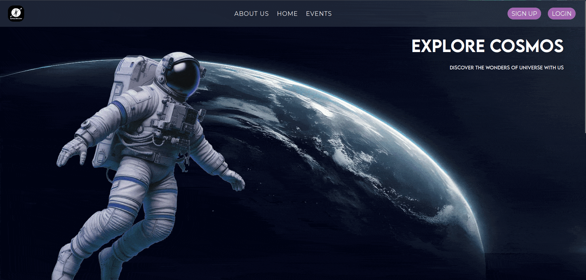

# 🚀 spaceCon

**spaceCon** is the official website for the Astronomy-Mathematics Fest that was planned in our college. It serves as a central hub for showcasing all the event details and redirecting users to registration platforms like Google Forms and Unstop.

## 🌟 Features

- 🧭 Event listings and detailed descriptions  
- 🔗 Easy redirection to event registration pages  
- 💻 Fully responsive and modern UI  
- 🌙 Theme tailored for a sci-fi / space vibe  

## 🛠 Tech Stack

- [Next.js](https://nextjs.org/) – for server-side rendering and routing  
- [Tailwind CSS](https://tailwindcss.com/) – for styling and utility-first design  
- [Material UI](https://mui.com/) – used in parts of the project (merged and managed during development)

## 🧩 My Role

As the lead developer:
- Managed and merged code from contributors
- Ensured compatibility between Tailwind UI and Material UI
- Oversaw the deployment and handled final UI consistency

## 📸 Screenshots of Local Deployement

  

## ⚠️ Disclaimer

This project is no longer actively maintained.  
To run it locally, you **will** encounter some dependency issues.

> Use `npm install` followed by:  
> `npm audit fix --force`  
> You might also have to manually fix other peer dependency warnings or version mismatches.

## 🤝 Contributions

This was a collaborative project. Shoutout to the team for the support and creative ideas during the development!

---

Feel free to fork or refer to the UI/logic if you're building something similar 🌌
